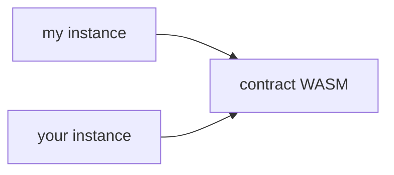

<head>
  <title>Smart contract state expiration.</title>
  <meta charSet="utf-8" />
  <meta property="og:title" content="Smart contract state expiration." />
  <meta
    property="og:description"
    content="Learn about how state expiration works on the Soroban smart contract platform."
  />
  <link
    rel="canonical"
    href="https://soroban.stellar.org/docs/fundamentals-and-concepts/state-expiration"
  />
</head>

Contract data is made up of three different types: `Persistent`, `Temporary`, and `Instance`. In a contract, these are accessed with `env.storage().persistent()`, `env.storage().temporary()`, and `env.storage().instance()` respectively; see the [`storage()` docs](https://docs.rs/soroban-sdk/latest/soroban_sdk/storage/struct.Storage.html).

All contract data has a "lifetime" that must be periodically bumped. If an entry's lifetime is not periodically bumped, the entry will eventually reach the end of its lifetime and "expire". Each type of storage functions similarly, but have different fees and expiration behavior:

- When a `Temporary` entry expires, it is deleted from the ledger and is permanently inaccessible.
- When a `Persistent` or `Instance` entry expires, it is inaccessible, but can be "restored" and used again via the [`RestoreFootprintOp`].

## Contract Data Type Descriptions

The general usage and interface is identical for all storage types. They differ only in fees and expiration behavior as follows:

### `Temporary`

- Cheapest fees.
- Permanently deleted on expiration, cannot be restored.
- Suitable for time bounded data (i.e. price oracles, signatures, etc.) and easily recreateable data.
- Unlimited amount of storage.

### `Instance`

- Most expensive fees (same price as `Persistent` storage).
- Recoverable after expiration, can be restored using the [`RestoreFootprintOp`] operation.
- Shares the same lifetime as the contract instance. If the contract instance has not expired, instance data is guaranteed to be accessible and not expired.
- Limited amount of storage available.
- Suitable for "shared" contract state that cannot be `Temporary` (i.e. admin accounts, contract metadata, etc.).

### `Persistent`

- Most expensive fees (same price as `Instance` storage).
- Recoverable after expiration, can be restored using the [`RestoreFootprintOp`] operation.
- Does not share the same lifetime as the contract instance. If the contract instance is not expired, `Persistent` data may be expired and need to be restored before invoking the contract.
- Unlimited amount of storage.
- Suitable for user data that cannot be `Temporary` (i.e. balances).

## Contract Data Best Practices

As a general rule, `Temporary` storage should only be used for data that can be easily recreated or is only valid for a period of time, where `Persistent` or `Instance` storage should be used for data that cannot be recreated and should be kept permanently, such as a user's token balance.

Each storage type is in a separate key space. To demonstrate this, see the code snippet below:

```rust
const EXAMPLE_KEY: Symbol = symbol_short!("KEY");
env.storage().persistent().set(&EXAMPLE_KEY, 1);
env.storage().temporary().set(&EXAMPLE_KEY, 2);

env.storage().persistent().get(&EXAMPLE_KEY); // Returns Ok(1)
env.storage().temporary().get(&EXAMPLE_KEY); // Returns Ok(2)
```

All `Instance` storage is stored in a single contract instance `LedgerEntry` and shares a single lifetime. This means that one call to `Env.storage().instance().bump()` will extend the lifetime of all `Instance`
entries, as well as the contract instance itself. For `Temporary` and `Persistent` storage, each entry has its own lifetime and must be bumped individually. The interface is slightly different and takes the key
of the entry being bumped as well as the new lifetime.

A call to `bump(N)` ensures that the current lifetime of the contract instance entry is _at least_ N ledgers. For example, if `bump(100)` is called and the contract instance entry has a current lifetime of 50 ledgers, the lifetime will be extended to 100 ledgers. If `bump(100)` is called and the contract instance entry has a current lifetime of 150 ledgers, the lifetime will not be extended and the `bump()` call is a no-op.

In addition to contract defined lifetime extensions using the `bump()` function, a contract data entry's lifetime can be extended via the [`BumpFootprintExpirationOp`] operation.

## Terms and Semantics

### Expiration Ledger

Each `ContractData` and `ContractCode` entry has an `expirationLedger` field stored in its `LedgerEntry`.
The entry is considered expired when `current_ledger > expirationLedger`.

### Lifetime

An entry's lifetime is defined as how many ledgers remain until the entry expires.
For example, if the current ledger is 5 and an entry's expiration ledger is 15, then
the entry's lifetime is 10 ledgers.

### Minimum Lifetime

For each entry type, there is a minimum lifetime that the entry must have when being created
or updated. This lifetime minimum is enforced automatically at the protocol level. This minimum
is a network parameter and defaults to 16 ledgers for `Temporary` entries and 4,096 ledgers for
`Persistent` and `Instance` entries.

### Maximum Lifetime

On any given ledger, an entry's lifetime can be extended up to the maximum lifetime. This is a
network parameter and defaults to 1 year worth of ledgers. This maximum lifetime is not enforced
based on when an entry was created, but based on the current ledger. For example, if an entry is
created on January 1st, 2024, its lifetime could initially be bumped up to January 1st, 2025.
After this initial lifetime bump, if the entry received another lifetime bump later on January 10th, 2024,
the lifetime could be extended up to January 10th, 2025.

## Operations

### BumpFootprintExpirationOp

#### Semantics

XDR:

```
/*
    Threshold: med
    Result: BumpFootprintExpirationResult
*/
struct BumpFootprintExpirationOp
{
    ExtensionPoint ext;
    uint32 ledgersToExpire;
};
```

`BumpFootprintExpirationOp` is a Soroban operation that will bump the expiration
ledger of the entries specified in the _read-only set of the footprint_. The
read-write set must be empty. The bump will make sure that the entries will not
expire before ledgersToExpire ledgers from now.

Let's look at this example below.

```
Ex. Last closed ledger (LCL) = 5, Current Ledger = 6, ledgersToExpire = 8

entry1.expirationLedger = 10
entry2.expirationLedger = 14
entry3.expirationLedger = 10000

entry1.expirationLedger will be updated to 14 so it will live for 8 more ledgers
after the current one closes and the entry can be accessed in ledgers [6, 14]. Note: This is going to be updated to count
Current Ledger, so it'll become [6, 13].

entry2 and entry3 will not be updated because they already have an
expirationLedger that is large enough.
```

#### Transaction resources

`BumpFootprintExpirationOp` is a Soroban operation, and therefore must be the
only operation in a transaction. The transaction also needs to populate
`SorobanTransactionData` transaction extension explained
[here](../fundamentals-and-concepts/invoking-contracts-with-transactions.mdx#transaction-resources). To fill
out `SorobanResources`, use preflight mentioned in the provided link, or make
sure `readBytes` includes the key and entry size of every entry in the
`readOnly` set and make sure `extendedMetaDataSizeBytes` is at least double of
`readBytes`.

### RestoreFootprintOp

XDR:

```
/*
    Threshold: med
    Result: RestoreFootprintOp
*/
struct RestoreFootprintOp
{
    ExtensionPoint ext;
};
```

`RestoreFootprintOp` is a Soroban operation that will restore expired entries
specified in the _read-write set of the footprint_ and make them accessible
again. The read-only set of the footprint must be empty. An expired entry is one
where its expirationLedger is less than the current ledger number. **Only persistent entries can be restored.**

The restored entry will have its expiration ledger bumped to the [minimum] the
network allows for newly created entries, which is `current_ledger_number + 4095` for
persistent entries. The minimum expiration value is a network configuration
parameter and is subject to be updated (likely increased) via network upgrades.

[minimum]: https://github.com/stellar/stellar-core/blob/2109a168a895349f87b502ae3d182380b378fa47/src/ledger/NetworkConfig.h#L77-L78

#### Transaction resources

`RestoreFootprintOp` is a Soroban operation, and therefore must be the only
operation in a transaction. The transaction also needs to populate
`SorobanTransactionData` transaction extension explained
[here](../fundamentals-and-concepts/invoking-contracts-with-transactions.mdx#transaction-resources). To fill
out `SorobanResources`, use preflight mentioned in the provided link, or make
sure `writeBytes` includes the key and entry size of every entry in the
`readWrite` set and make sure `extendedMetaDataSizeBytes` is at least double of
`writeBytes`.

---

## Examples

We've done our best to build tooling around state expiration in both the Soroban RPC server as well as the JavaScript SDK to make it easier to deal with, and this set of examples demonstrates how to leverage it.

### Overview

Both restoring and bumping the expiration of ledger entries follows a multi-step process regardless of their nature (contract data, instances, etc.):

1. **Identify the ledger entries**. This usually means acquiring them from a Soroban RPC server as part of your initial transaction simulation (see the [preflight docs](https://soroban.stellar.org/docs/fundamentals-and-concepts/interacting-with-contracts#preflight) and the [`simulateTransaction`](https://soroban.stellar.org/api/methods/simulateTransaction) method).

2. **Prepare your operation**. This means describing the ledger entries within the corresponding operation (i.e. `bumpFootprintOp` or `restoreFootprintOp`) and its ledger footprint (the `SorobanTransactionData` field), then simulating it to fill out fee and resource usage information (when restoring, you usually have simulation results already).

3. **Submit the transaction** and start again with what you were trying to do in the first place.

Each of the examples below will follow a structure like this. We'll work our way through two different scenarios:

1. [a piece of persistent data in my contract expired](#example-my-data-expired)
2. [my contract instance or the WASM expired](#example-my-contract-expired)

Remember, though, that any combination of these scenarios can occur in reality.

### Preparation

In order to help the scaffolding of the code, we'll introduce some reusable components. The following is a simple, rudimentary looping mechanism to submit a transaction to Soroban RPC and wait for a result:

```typescript
import {
  Server,
  SorobanRpc,
  Transaction,
  FeeBumpTransaction,
} from "soroban-client";

const RPC_SERVER = "https://rpc-futurenet.stellar.org/";
const server = new Server(RPC_SERVER);

// Submits a tx and then polls for its status until a timeout is reached.
async function yeetTx(
  tx: Transaction | FeeBumpTransaction,
): Promise<SorobanRpc.GetTransactionResponse> {
  return server.sendTransaction(tx).then(async (reply) => {
    if (reply.status !== "PENDING") {
      throw reply;
    }

    let status;
    let attempts = 0;
    while (attempts++ < 5) {
      const tmpStatus = await server.getTransaction(reply.hash);
      switch (tmpStatus.status) {
        case "FAILED":
          throw tmpStatus;
        case "NOT_FOUND":
          await sleep(500);
          continue;
        case "SUCCESS":
          status = tmpStatus;
          break;
      }
    }

    if (attempts >= 5 || !status) {
      throw new Error(`Failed to find transaction ${reply.hash} in time.`);
    }

    return status;
  });
}

function sleep(ms: number) {
  return new Promise((resolve) => setTimeout(resolve, ms));
}
```

We'll use this helper below to submit transactions and report their status reliably.

:::caution

Remember: You should always handle errors gracefully! This is a fail hard and fail fast approach that should only be used in these examples.

:::

In the following code, we will also leverage [`Server.prepareTransaction`](https://stellar.github.io/js-soroban-client/Server.html#prepareTransaction). This is a helpful method that, given a transaction, will simulate it, then amend the transaction with the simulation results (fees, etc.) and return that. Then, it can just be signed and submitted.

### Example: My data expired!

We'll start with the likeliest occurrence: my piece of persistent data expired off of the ledger because I haven't interacted with my contract in a while. How do I get it back?

In this example, we will assume two things: the contract itself is still alive (i.e. others have been bumping its expiration while you've been away) and you don't know how your expired data is represented on the ledger. If you did, you could skip the steps below where we figure that out and just set up the restoration footprint directly. The process involves three discrete steps:

1. Simulate our transaction as we normally would.
2. If the simulation indicated it, we perform restoration via [`Operation.restoreFootprint`](https://stellar.github.io/js-soroban-client/Operation.html#.restoreFootprint) using its hints.
3. We retry running our initial transaction.

Let's see that in code:

```typescript
import {
  BASE_FEE,
  Networks,
  Keypair,
  TransactionBuilder,
  SorobanDataBuilder,
  assembleTransaction,
  xdr,
} from "soroban-client"; // add'l imports to preamble

// assume that `s` is the Server() instance from the preamble

async function submitOrRestoreAndRetry(
  signer: Keypair,
  tx: Transaction,
): Promise<SorobanRpc.GetTransactionResponse> {
  const sim = await s.simulateTransaction(tx);

  // Other failures are out of scope of this tutorial.
  if (!SorobanRpc.isSimulationSuccess(sim)) {
    throw sim;
  }

  // If simulation didn't fail, we don't need to restore anything! Just send it.
  if (!sim.restorePreamble) {
    const prepTx = assembleTransaction(tx, Networks.FUTURENET, sim);
    prepTx.sign(signer);
    return yeetTx(prepTx);
  }

  //
  // Build the restoration operation using the RPC server's hints.
  //
  const account = await s.getAccount(signer.publicKey());
  let fee = parseInt(BASE_FEE);
  fee += parseInt(sim.restorePreamble.minResourceFee);

  const restoreTx = new TransactionBuilder(account, { fee: fee.toString() })
    .setNetworkPassphrase(Networks.FUTURENET)
    .setSorobanData(sim.restorePreamble.transactionData.build())
    .addOperation(Operation.restoreFootprint({}))
    .build();

  restoreTx.sign(signer);

  const resp = await yeetTx(restoreTx);
  if (resp.status !== SorobanRpc.GetTransactionStatus.SUCCESS) {
    throw resp;
  }

  //
  // now that we've restored the necessary data, we can retry our tx using
  // the initial data from the simulation (which, hopefully, is still
  // up-to-date)
  //
  const retryTxBuilder = TransactionBuilder.cloneFrom(tx, {
    fee: (parseInt(tx.fee) + parseInt(sim.minResourceFee)).toString(),
    sorobanData: sim.transactionData.build(),
  });
  // because we consumed a sequence number when restoring, we need to make sure
  // we set the correct value on this copy
  retryTxBuilder.source.incrementSequenceNumber();

  const retryTx = retryTxBuilder.build();
  retryTx.sign(signer);

  return yeetTx(retryTx);
}
```

Notice that when restoration is required, **simulation still succeeds**. The way that we know that something needs to be restored is the presence of a `restorePreamble` structure in the RPC's response. This contains both the footprint and fee needed for restoration, while the rest of the response contains the invocation simulation **as if** that restoration was done first.

This is great, as it means fewer round-trips to get going again!

### Example: My contract expired!

As you can imagine, if the ledger cannot find your deployed contract instance or the code that backs it, it can't load it to execute your invocations. Remember, there's a distinct, one-to-many relationship on the chain between a contract's code and deployed instances of that contract:



We need **both** to stay on the ledger for our contract calls to work.

Let's work through how these can be recovered. They are slightly different for a convenient reason: we don't need simulation to figure out the _footprints_ (though you still can do it that way). Instead, we can leverage [`Contract.getFootprint()`](https://stellar.github.io/js-soroban-client/Contract.html#getFootprint), which prepares a footprint related to the ledger keys used specifically by a given contract instance. Unfortunately, we still need simulation to figure out the _fees_:

```typescript
import {
  BASE_FEE,
  Contract,
  Keypair,
  Networks,
  TransactionBuilder,
  SorobanDataBuilder,
  Operation,
  SorobanRpc,
} from "soroban-client";

async function restoreContract(
  signer: Keypair,
  c: Contract,
): Promise<SorobanRpc.GetTransactionResponse> {
  const account = await server.getAccount(signer.publicKey());
  const restoreTx = new TransactionBuilder(account, { fee: BASE_FEE })
    .setNetworkPassphrase(Networks.FUTURENET)
    .setSorobanData(
      new SorobanDataBuilder().setReadOnly(c.getFootprint()).build(),
    )
    .addOperation(Operation.restoreFootprint({}))
    .build();

  const preppedTx = await s.prepareTransaction(restoreTx, Networks.FUTURENET);
  preppedTx.sign(signer);
  return yeetTx(preppedTx);
}
```

The nice part about this approach is that it will restore both the instance and the backing WASM code if necessary, and do nothing for entries that don't need restoration. You will still pay fees for the no-op restoration, but these should be minor. You could, of course, be a little more careful and figure out which ones _actually_ need to be restored (much like in the data case, above), but we won't cover that here.

[`RestoreFootprintOp`]: #RestoreFootprintOp
[`BumpFootprintExpirationOp`]: #BumpFootprintExpirationOp
