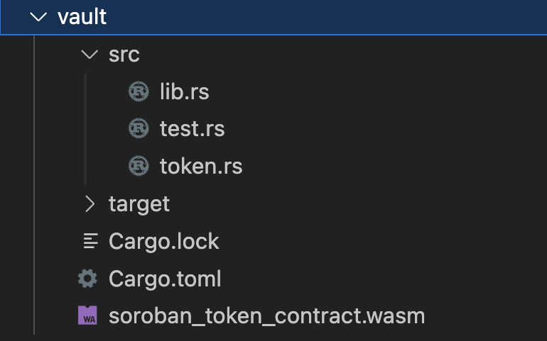
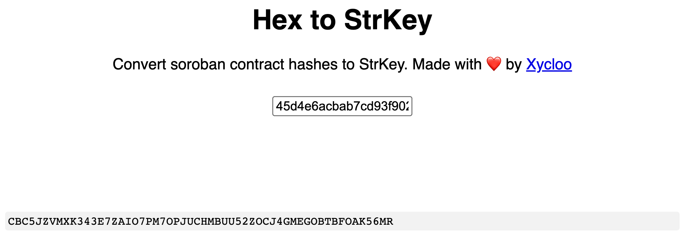

import Tabs from "@theme/Tabs";
import TabItem from "@theme/TabItem";

# Smart Contract Development with Soroban and Hardhat

In this tutorial, we will discover the similarities in smart contract deployment by examing workflows with [Soroban](../../) and [Hardhat](https://hardhat.org/). We will dive into the intricacies of each framework, learn to write secure and efficient smart contract code, and harness the power of Rust and Soroban to create customized contract logic.

## Table of Contents

1. [Soroban and Hardhat Comparison](#soroban-and-hardhat-comparison)
2. [Hardhat vs Soroban SDKs](#hardhat-vs-soroban-sdks)
3. [Using Rust and Soroban for Smart Contract Development](#developing-smart-contracts-with-rust-and-soroban)
4. [Vault Contract Deployment and Interaction](#vault-contract-deployment-and-interaction)

## Soroban and Hardhat Comparison

### Introduction

Soroban and Hardhat are both frameworks that enable developers to build, test, and deploy smart contracts. In this section, we will delve into the similarities and distinctions between these two frameworks.

### Soroban Framework

Soroban is a Rust-based framework tailored for developing smart contracts on the Stellar network. Designed as a lightweight framework, with [tools to support developers](../reference/soroban-cli), Soroban allows developers to develop smart contracts through a simple and intuitive workflow.

### Hardhat

Hardhat serves as a development environment for compiling, deploying, testing, and debugging smart contracts for the EVM. It assists developers in managing and automating recurring tasks inherent to building smart contracts.

### Similarities

Soroban and Hardhat are powerful frameworks designed to streamline the process of building, testing, and deploying smart contracts. Equipped with a comprehensive suite of tools, these frameworks facilitate the development of smart contracts and their deployment on their respective virtual machines.

### Differences

Soroban, with its lightweight design, offers developers an exceptional platform for writing Rust-based smart contracts and deploying them effortlessly on the Stellar network. In contrast, Hardhat serves primarily as a development environment tailored for the Ethereum Virtual Machine, providing a different focus and target audience.

## Hardhat vs Soroban SDKs

Hardhat offers a streamlined workflow for deploying smart contracts on the Ethereum Virtual Machine, with key components such as `ethers.js`, `scripts`, and `testing` playing crucial roles.

On the other hand, Soroban presents a compelling alternative, boasting powerful SDKs that facilitate smart contract development and deployment. In the upcoming section, we will delve into [Soroban's SDKs](../category/sdks), drawing comparisons with Hardhat components, and highlighting the unique advantages each platform brings to the table.

### Ethers.js

`Ethers.js` is a widely-used `JavaScript` library designed for seamless interaction with the EVM. It offers a user-friendly interface that simplifies connecting to Ethereum nodes, managing accounts, and sending transactions. Additionally, `Ethers.js` provides a robust API for efficient communication with smart contracts. This library is a core component of the Hardhat framework and can be imported into scripts to streamline the deployment of smart contracts.

```javascript
const { ethers } = require("hardhat");

async function main() {
  const [deployer] = await ethers.getSigners();

  console.log("Deploying contracts with the account:", deployer.address);
}
```

### Soroban Client

Soroban offers a comparable library, [`js-soroban-client`](../reference/sdks/js), that enables seamless interaction smart contracts deployed on the Stellar Newtork. This library supplies a comprehensive networking layer API for `soroban-rpc` methods, simplifying the process of building and signing transactions. Additionally, `js-soroban-client` streamlines communication with `soroban-rpc` instances and supports submitting transactions or querying network state with ease.

### Scripts

Hardhat scripts streamline the automation of routine tasks, such as deploying and managing smart contracts. Developers can create these scripts using either JavaScript or TypeScript, catering to their preferred programming style. They are stored in the `scripts` directory of a Hardhat project and can be executed using the `npx hardhat run` command.

```javascript
// scripts/deploy.js

async function main() {
  // Compile and deploy the smart contract
  const MyContract = await ethers.getContractFactory("MyContract");
  const myContract = await MyContract.deploy();

  console.log("MyContract deployed to:", myContract.address);
}

main()
  .then(() => process.exit(0))
  .catch((error) => {
    console.error(error);
    process.exit(1);
  });
```

### Soroban Scripts

Soroban offers an extensive collection of SDKs that include scripting capabilities, ensuring a smooth workflow for deploying and managing smart contracts. Developers can automate tasks such as compiling, deploying, and interacting with smart contracts using a variety of SDKs that support scripting in languages like [`JavaScript`, `TypeScript`, `Python` and others](../category/sdks).

```python
# This example shows how to deploy a compiled contract to the Stellar network.
# https://github.com/stellar/soroban-quest/blob/main/quests/6-asset-interop/py-scripts/deploy-contract.py

import time

from stellar_sdk import Network, Keypair, TransactionBuilder
from stellar_sdk import xdr as stellar_xdr
from stellar_sdk.soroban import SorobanServer
from stellar_sdk.soroban.soroban_rpc import TransactionStatus

# TODO: You need to replace the following parameters according to the actual situation
secret = "SAAPYAPTTRZMCUZFPG3G66V4ZMHTK4TWA6NS7U4F7Z3IMUD52EK4DDEV"
rpc_server_url = "http://127.0.0.1:8000/soroban/rpc"
network_passphrase = Network.FUTURENET_NETWORK_PASSPHRASE
contract_file_path = "/path/to/compiled/soroban_contract.wasm"

kp = Keypair.from_secret(secret)
soroban_server = SorobanServer(rpc_server_url)

print("installing contract...")
source = soroban_server.load_account(kp.public_key)

# with open(contract_file_path, "rb") as f:
#     contract_bin = f.read()

tx = (
    TransactionBuilder(source, network_passphrase)
    .set_timeout(300)
    .append_install_contract_code_op(
        contract=contract_file_path,  # the path to the contract, or binary data
        source=kp.public_key,
    )
    .build()
)
...
```

### Testing

Hardhat provides a testing framework that allows developers to write tests for their smart contracts. These tests can be written in JavaScript or TypeScript and run using the `npx hardhat test` command.

```javascript
// test/my-contract.js

const { expect } = require("chai");

describe("MyContract", function () {
  it("Should return the correct name", async function () {
    const MyContract = await ethers.getContractFactory("MyContract");
    const myContract = await MyContract.deploy();

    await myContract.deployed();
    expect(await myContract.name()).to.equal("MyContract");
  });
});
```

### Soroban Testing

Soroban enables users to leverage the power of Rust's testing framework to write tests for their smart contracts. These tests can be written in Rust and run using the `cargo test` command.

```rust
#![cfg(test)]

use super::*;
use soroban_sdk::{vec, Env, Symbol};

#[test]
fn test() {
    let env = Env::default();
    let contract_id = env.register_contract(None, HelloContract);
    let client = HelloContractClient::new(&env, &contract_id);

    let words = client.hello(&Symbol::short("Dev"));
    assert_eq!(
        words,
        vec![&env, Symbol::short("Hello"), Symbol::short("Dev"),]
    );
}
```

In summary, while Hardhat provides an excellent environment for deploying smart contracts on the EVM, Soroban's Rust-based framework offers significant advantages in terms of performance, making it an ideal choice for building secure and efficient smart contracts.

## Developing Smart Contracts with Rust and Soroban

### Introduction

Now that we've examined the deployment workflow with Hardhat, let's explore developing and deploying smart contracts with Rust and Soroban. The key advantage of using Soroban is its ability to leverage Rust's safety features and performance, making it an excellent choice for developing secure and efficient smart contracts.

We've learned that Smart contracts are self-executing contracts that can be programmed to automatically enforce the rules and regulations of a particular agreement. They are a core component of decentralized applications (dApps) and blockchain technology. In this section, we will learn how to use Rust and Soroban to develop and deploy custom smart contract logic.

### Setup

If you haven't already setup up the dev environment for Soroban, you can get started by following the steps on the [Setup Page](http://localhost:3000/docs/getting-started/setup).

This project requires using the `soroban_token_contract.wasm` file which you will need to import manually.

First, you will need to clone the `v0.7.0` tag of `soroban-examples` repository:

```zsh
git clone -b v0.7.0 https://github.com/stellar/soroban-examples
```

Then, navigate to the `soroban-examples/token` directory

```zsh
cd soroban-examples/token
```

Next, build the Token contract using the following command:

```zsh
cargo build --target wasm32-unknown-unknown --release
```

This will build the `soroban_token_contract.wasm` file which you will need to import into your project. The `soroban_token_contract.wasm` file is located in the `soroban-examples/target/wasm32-unknown-unknown/release` directory.

```
soroban-examples
├── target
│   └── wasm32-unknown-unknown
│       └── release
│           └── soroban_token_contract.wasm
└──
```

Once we have the Token, lets create a new smart contract that uses it.

### Writing a Smart Contract

Let's start by writing a simple example of a vault contract that allows users to deposit funds and withdraw their funds with generated yield.

Here is a breakdown of the contract mechanics

- Shares are minted when a user deposits.
- The DeFi protocol uses the users' deposits to generate yield.
- User burns shares to withdraw their tokens + yield.

In a new terminal, lets create a new Rust project by running the following command:

```zsh
cargo new vault
```

This will create a new Rust project called `vault`.

Now lets add the `soroban_token_contract.wasm` file to the `vault` project. To do this, we can drag and drop the file into the `vault` project directory.



Next, we'll need to add the Soroban SDK as a dependency. To do this, open the `Cargo.toml` file in your project and ensure that it matches the following:

```toml
[package]
name = "vault"
version = "0.0.0"
edition = "2021"
publish = false

[lib]
crate-type = ["cdylib"]

[dependencies]
soroban-sdk = { version = "0.7.0", git = "https://github.com/stellar/rs-soroban-sdk", rev = "8abd3353c728f09ee1c8a2544f67a853e915afc2"}
num-integer = { version = "0.1.45", default-features = false, features = ["i128"] }

[dev_dependencies]
soroban-sdk = { version = "0.7.0", git = "https://github.com/stellar/rs-soroban-sdk", rev = "8abd3353c728f09ee1c8a2544f67a853e915afc2", features = ["testutils"] }

[profile.release]
opt-level = "z"
overflow-checks = true
debug = 0
strip = "symbols"
debug-assertions = false
panic = "abort"
codegen-units = 1
lto = true

[profile.release-with-logs]
inherits = "release"
debug-assertions = true
```

In this project we will need to create 3 files:

- `src/lib.rs` - This is where we will write our vault smart contract logic.
- `src/test.rs` - This is where we will write our tests.
- `src/token.rs` - This is file inherits the token contact that we imported earlier. It's also where we will write our token creation logic.

To interact with the token contract, we'll use a built in interface that you can find in the `token_interface.rs` tab. This interface includes the `initialize` and `mint` functions that we will use to create and mint tokens for us to use in our vault contract. If you want to see the full code of the token contract, you can check it out [here](https://github.com/stellar/soroban-examples/tree/main/token/src).

<Tabs>
<TabItem value="lib.rs" label="src/lib.rs">

```rust
#![no_std]

mod test;
mod token;

use soroban_sdk::{contractimpl, Address, Bytes, BytesN, ConversionError, Env, RawVal, TryFromVal};
use token::create_contract;

#[derive(Clone, Copy)]
#[repr(u32)]
pub enum DataKey {
    Token = 0,
    TokenShare = 1,
    TotalShares = 2,
    Reserve = 3,
}

impl TryFromVal<Env, DataKey> for RawVal {
    type Error = ConversionError;

    fn try_from_val(_env: &Env, v: &DataKey) -> Result<Self, Self::Error> {
        Ok((*v as u32).into())
    }
}

fn get_token(e: &Env) -> BytesN<32> {
    e.storage().get_unchecked(&DataKey::Token).unwrap()
}

fn get_token_share(e: &Env) -> BytesN<32> {
    e.storage().get_unchecked(&DataKey::TokenShare).unwrap()
}

fn get_total_shares(e: &Env) -> i128 {
    e.storage().get_unchecked(&DataKey::TotalShares).unwrap()
}

fn get_reserve(e: &Env) -> i128 {
    e.storage().get_unchecked(&DataKey::Reserve).unwrap()
}

fn get_balance(e: &Env, contract_id: BytesN<32>) -> i128 {
    token::Client::new(e, &contract_id).balance(&e.current_contract_address())
}

fn get_token_balance(e: &Env) -> i128 {
    get_balance(e, get_token(e))
}

fn get_balance_shares(e: &Env) -> i128 {
    get_balance(e, get_token_share(e))
}

fn put_token(e: &Env, contract_id: BytesN<32>) {
    e.storage().set(&DataKey::Token, &contract_id);
}

fn put_token_share(e: &Env, contract_id: BytesN<32>) {
    e.storage().set(&DataKey::TokenShare, &contract_id);
}

fn put_total_shares(e: &Env, amount: i128) {
    e.storage().set(&DataKey::TotalShares, &amount)
}

fn put_reserve(e: &Env, amount: i128) {
    e.storage().set(&DataKey::Reserve, &amount)
}

fn burn_shares(e: &Env, amount: i128) {
    let total = get_total_shares(e);
    let share_contract_id = get_token_share(e);

    token::Client::new(e, &share_contract_id).burn(&e.current_contract_address(), &amount);
    put_total_shares(e, total - amount);
}

fn mint_shares(e: &Env, to: Address, amount: i128) {
    let total = get_total_shares(e);
    let share_contract_id = get_token_share(e);

    token::Client::new(e, &share_contract_id).mint(&e.current_contract_address(), &to, &amount);

    put_total_shares(e, total + amount);
}

pub trait VaultTrait {
    // Sets the token contract addresses for this vault
    fn initialize(e: Env, token_wasm_hash: BytesN<32>, token: BytesN<32>);

    // Returns the token contract address for the vault share token
    fn share_id(e: Env) -> BytesN<32>;

    // Deposits token. Also mints vault shares for the "to" Identifier. The amount minted
    // is determined based on the difference between the reserves stored by this contract, and
    // the actual balance of token for this contract.
    fn deposit(e: Env, to: Address, amount: i128);

    // xfers share_amount of vault share tokens to this contract, burns all vaults share tokens in this contracts, and sends the
    // corresponding amount of token to "to".
    // Returns amount of token withdrawn
    fn withdraw(e: Env, to: Address, amount: i128) -> i128;

    // Returns the amount of token that can be withdrawn for the given amount of vault shares
    fn get_rsrvs(e: Env) -> i128;
}

struct Vault;

#[contractimpl]
impl VaultTrait for Vault {
    fn initialize(e: Env, token_wasm_hash: BytesN<32>, token: BytesN<32>) {
        let share_contract_id = create_contract(&e, &token_wasm_hash, &token);
        token::Client::new(&e, &share_contract_id).initialize(
            &e.current_contract_address(),
            &7u32,
            &Bytes::from_slice(&e, b"Vault Share Token"),
            &Bytes::from_slice(&e, b"VLT"),
        );

        put_token(&e, token);
        put_token_share(&e, share_contract_id.try_into().unwrap());
        put_total_shares(&e, 0);
        put_reserve(&e, 0);
    }

    fn share_id(e: Env) -> BytesN<32> {
        get_token_share(&e)
    }

    fn deposit(e: Env, to: Address, amount: i128) {
        // Depositor needs to authorize the deposit
        to.require_auth();

        let token_client = token::Client::new(&e, &get_token(&e));

        token_client.xfer(&to, &e.current_contract_address(), &amount);

        let balance_a = get_token_balance(&e);
        let total_shares = get_total_shares(&e);

        mint_shares(&e, to, amount);
        put_reserve(&e, balance_a);
        put_total_shares(&e, total_shares + amount)
    }

    fn withdraw(e: Env, to: Address, amount: i128) -> i128 {
        to.require_auth();

        // First transfer the vault shares that need to be redeemed
        let share_token_client = token::Client::new(&e, &get_token_share(&e));
        share_token_client.xfer(&to, &e.current_contract_address(), &amount);

        let token_client = token::Client::new(&e, &get_token(&e));
        token_client.xfer(
            &e.current_contract_address(),
            &to,
            &(&amount + (&amount / &100)),
        );

        let balance = get_token_balance(&e);
        let balance_shares = get_balance_shares(&e);

        let total_shares = get_total_shares(&e);

        if total_shares < amount {
            panic!("not enought shares to withdraw");
        }

        burn_shares(&e, balance_shares);
        put_total_shares(&e, total_shares - amount);
        put_reserve(&e, balance);

        amount
    }

    fn get_rsrvs(e: Env) -> i128 {
        get_reserve(&e)
    }
}
```

</TabItem>
<TabItem value="test.rs" label="src/test.rs" default>

```rust
#![cfg(test)]

use crate::{token, VaultClient};

use soroban_sdk::{testutils::Address as _, Address, BytesN, Env};

fn create_token_contract(e: &Env, admin: &Address) -> token::Client {
    token::Client::new(&e, &e.register_stellar_asset_contract(admin.clone()))
}

fn create_vault_contract(e: &Env, token_wasm_hash: &BytesN<32>, token: &BytesN<32>) -> VaultClient {
    let vault = VaultClient::new(e, &e.register_contract(None, crate::Vault {}));
    vault.initialize(token_wasm_hash, token);
    vault
}

fn install_token_wasm(e: &Env) -> BytesN<32> {
    soroban_sdk::contractimport!(file = "./soroban_token_contract.wasm");
    e.install_contract_wasm(WASM)
}

#[test]
fn test() {
    let e: Env = Default::default();

    let admin1 = Address::random(&e);

    let token = create_token_contract(&e, &admin1);
    let user = Address::random(&e);
    let vault = create_vault_contract(&e, &install_token_wasm(&e), &token.contract_id);

    let contract_share: [u8; 32] = vault.share_id().into();
    let token_share = token::Client::new(&e, &contract_share);

    token.mint(&admin1, &user, &100);
    token.mint(&admin1, &vault.address(), &100);
    assert_eq!(token.balance(&vault.address()), 100);
    assert_eq!(token.balance(&user), 100);

    assert_eq!(token_share.balance(&user), 0);
    vault.deposit(&user, &100);
    assert_eq!(token_share.balance(&user), 100);
    assert_eq!(token_share.balance(&vault.address()), 0);
    assert_eq!(token.balance(&user), 0);
    assert_eq!(token.balance(&vault.address()), 200);
    assert_eq!(vault.get_rsrvs(), 200);

    let withdraw_amount = 100;
    vault.withdraw(&user, &withdraw_amount);
    let yield_amount = &(withdraw_amount / 100);
    assert_eq!(token.balance(&user), 100 + yield_amount);
    assert_eq!(token_share.balance(&user), 0);
    assert_eq!(token.balance(&vault.address()), 99);
    assert_eq!(vault.get_rsrvs(), 99);
    assert_eq!(token_share.balance(&vault.address()), 0);
}
```

</TabItem>
<TabItem value="token.rs" label="src/token.rs" default>

```rust
#![allow(unused)]
use soroban_sdk::{Bytes, BytesN, Env};

soroban_sdk::contractimport!(file = "./soroban_token_contract.wasm");

pub fn create_contract(e: &Env, token_wasm_hash: &BytesN<32>, token_a: &BytesN<32>) -> BytesN<32> {
    let mut salt = Bytes::new(e);
    salt.append(&token_a.clone().into());

    let salt = e.crypto().sha256(&salt);
    e.deployer()
        .with_current_contract(&salt)
        .deploy(token_wasm_hash)
}
```

</TabItem>

<TabItem value="token_interface.rs" label="src/token_interface.rs">

```rust
//! This contract demonstrates a sample implementation of the Soroban token
//! interface.
use crate::admin::{check_admin, has_administrator, write_administrator};
use crate::allowance::{read_allowance, spend_allowance, write_allowance};
use crate::balance::{is_authorized, write_authorization};
use crate::balance::{read_balance, receive_balance, spend_balance};
use crate::event;
use crate::metadata::{
    read_decimal, read_name, read_symbol, write_decimal, write_name, write_symbol,
};
use soroban_sdk::{contractimpl, Address, Bytes, Env};

pub trait TokenTrait {
    fn initialize(e: Env, admin: Address, decimal: u32, name: Bytes, symbol: Bytes);

    fn allowance(e: Env, from: Address, spender: Address) -> i128;

    fn incr_allow(e: Env, from: Address, spender: Address, amount: i128);

    fn decr_allow(e: Env, from: Address, spender: Address, amount: i128);

    fn balance(e: Env, id: Address) -> i128;

    fn spendable(e: Env, id: Address) -> i128;

    fn authorized(e: Env, id: Address) -> bool;

    fn xfer(e: Env, from: Address, to: Address, amount: i128);

    fn xfer_from(e: Env, spender: Address, from: Address, to: Address, amount: i128);

    fn burn(e: Env, from: Address, amount: i128);

    fn burn_from(e: Env, spender: Address, from: Address, amount: i128);

    fn clawback(e: Env, admin: Address, from: Address, amount: i128);

    fn set_auth(e: Env, admin: Address, id: Address, authorize: bool);

    fn mint(e: Env, admin: Address, to: Address, amount: i128);

    fn set_admin(e: Env, admin: Address, new_admin: Address);

    fn decimals(e: Env) -> u32;

    fn name(e: Env) -> Bytes;

    fn symbol(e: Env) -> Bytes;
}

fn check_nonnegative_amount(amount: i128) {
    if amount < 0 {
        panic!("negative amount is not allowed: {}", amount)
    }
}

pub struct Token;

#[contractimpl]
impl TokenTrait for Token {
    fn initialize(e: Env, admin: Address, decimal: u32, name: Bytes, symbol: Bytes) {
        if has_administrator(&e) {
            panic!("already initialized")
        }
        write_administrator(&e, &admin);

        write_decimal(&e, u8::try_from(decimal).expect("Decimal must fit in a u8"));
        write_name(&e, name);
        write_symbol(&e, symbol);
    }

    fn allowance(e: Env, from: Address, spender: Address) -> i128 {
        read_allowance(&e, from, spender)
    }

    fn incr_allow(e: Env, from: Address, spender: Address, amount: i128) {
        from.require_auth();

        check_nonnegative_amount(amount);

        let allowance = read_allowance(&e, from.clone(), spender.clone());
        let new_allowance = allowance
            .checked_add(amount)
            .expect("Updated allowance doesn't fit in an i128");

        write_allowance(&e, from.clone(), spender.clone(), new_allowance);
        event::incr_allow(&e, from, spender, amount);
    }

    fn decr_allow(e: Env, from: Address, spender: Address, amount: i128) {
        from.require_auth();

        check_nonnegative_amount(amount);

        let allowance = read_allowance(&e, from.clone(), spender.clone());
        if amount >= allowance {
            write_allowance(&e, from.clone(), spender.clone(), 0);
        } else {
            write_allowance(&e, from.clone(), spender.clone(), allowance - amount);
        }
        event::decr_allow(&e, from, spender, amount);
    }

    fn balance(e: Env, id: Address) -> i128 {
        read_balance(&e, id)
    }

    fn spendable(e: Env, id: Address) -> i128 {
        read_balance(&e, id)
    }

    fn authorized(e: Env, id: Address) -> bool {
        is_authorized(&e, id)
    }

    fn xfer(e: Env, from: Address, to: Address, amount: i128) {
        from.require_auth();

        check_nonnegative_amount(amount);
        spend_balance(&e, from.clone(), amount);
        receive_balance(&e, to.clone(), amount);
        event::transfer(&e, from, to, amount);
    }

    fn xfer_from(e: Env, spender: Address, from: Address, to: Address, amount: i128) {
        spender.require_auth();

        check_nonnegative_amount(amount);
        spend_allowance(&e, from.clone(), spender, amount);
        spend_balance(&e, from.clone(), amount);
        receive_balance(&e, to.clone(), amount);
        event::transfer(&e, from, to, amount)
    }

    fn burn(e: Env, from: Address, amount: i128) {
        from.require_auth();

        check_nonnegative_amount(amount);
        spend_balance(&e, from.clone(), amount);
        event::burn(&e, from, amount);
    }

    fn burn_from(e: Env, spender: Address, from: Address, amount: i128) {
        spender.require_auth();

        check_nonnegative_amount(amount);
        spend_allowance(&e, from.clone(), spender, amount);
        spend_balance(&e, from.clone(), amount);
        event::burn(&e, from, amount)
    }

    fn clawback(e: Env, admin: Address, from: Address, amount: i128) {
        check_nonnegative_amount(amount);
        check_admin(&e, &admin);
        admin.require_auth();
        spend_balance(&e, from.clone(), amount);
        event::clawback(&e, admin, from, amount);
    }

    fn set_auth(e: Env, admin: Address, id: Address, authorize: bool) {
        check_admin(&e, &admin);
        admin.require_auth();
        write_authorization(&e, id.clone(), authorize);
        event::set_auth(&e, admin, id, authorize);
    }

    fn mint(e: Env, admin: Address, to: Address, amount: i128) {
        check_nonnegative_amount(amount);
        check_admin(&e, &admin);
        admin.require_auth();
        receive_balance(&e, to.clone(), amount);
        event::mint(&e, admin, to, amount);
    }

    fn set_admin(e: Env, admin: Address, new_admin: Address) {
        check_admin(&e, &admin);
        admin.require_auth();
        write_administrator(&e, &new_admin);
        event::set_admin(&e, admin, new_admin);
    }

    fn decimals(e: Env) -> u32 {
        read_decimal(&e)
    }

    fn name(e: Env) -> Bytes {
        read_name(&e)
    }

    fn symbol(e: Env) -> Bytes {
        read_symbol(&e)
    }
}
```

</TabItem>
</Tabs>

Now that we've added these files to our project, lets break down what happens in the `lib.rs` file above and discover how "yield" is generated from our vault contract

First, let's take a look at what happens when a user deposits tokens into the vault contract.

```rust
fn deposit(e: Env, to: Address, amount: i128) {
    // Depositor needs to authorize the deposit
    to.require_auth();

    let token_client = token::Client::new(&e, &get_token(&e));

    token_client.xfer(&to, &e.current_contract_address(), &amount);

    let balance_a = get_token_balance(&e);
    let total_shares = get_total_shares(&e);

    mint_shares(&e, to, amount);
    put_reserve(&e, balance_a);
    put_total_shares(&e, total_shares + amount)
}
```

- The `deposit` function is called by the depositor to deposit tokens into the vault contract.
- The `xfer` method of the `token_client` instance transfers tokens from the depositor to the vault contract.
- The current token balance and total shares issued by the vault contract are obtained using the `get_token_balance` and `get_total_shares` functions, respectively.
- `mint_shares` is called to issue new shares to the depositor.
- `put_reserve` stores the current token balance in a reserved location.
- `put_total_shares` updates the total shares issued by the vault contract.

If the user were to call the `deposit` method with 100 tokens, the following would happen:

- 100 tokens would be transferred from the depositor to the vault contract.
- The current token balance would be stored in a reserved location.
- The total shares issued by the vault contract would be updated to 100.
- 100 shares would be issued to the depositor.

Now, let's see what happens when a user withdraws tokens from the vault.

```rust
fn withdraw(e: Env, to: Address, amount: i128) -> i128 {
    to.require_auth();

    // First transfer the vault shares that need to be redeemed
    let share_token_client = token::Client::new(&e, &get_token_share(&e));
    share_token_client.xfer(&to, &e.current_contract_address(), &amount);

    let token_client = token::Client::new(&e, &get_token(&e));
    token_client.xfer(
        &e.current_contract_address(),
        &to,
        &(&amount + (&amount / &100)),
    );

    let balance = get_token_balance(&e);
    let balance_shares = get_balance_shares(&e);

    let total_shares = get_total_shares(&e);

    if total_shares < amount {
        panic!("not enought shares to withdraw");
    }

    burn_shares(&e, balance_shares);
    put_total_shares(&e, total_shares - amount);
    put_reserve(&e, balance);

    amount
}
```

- The `withdraw` function is called by the withdrawer to withdraw tokens from the vault contract.
- The `xfer` method of the `share_token_client` instance transfers shares from the withdrawer to the vault contract.
- The `xfer` method of the `token_client` instance transfers tokens from the vault contract to the withdrawer.
- `burn_shares` is called to burn the shares that were transferred to the vault contract.
- `put_reserve` stores the current token balance in a reserved location.

> _Note_ : In the withdrawal function, you'll notice that the transfer amount is defined as `&(&amount + (&amount / &100))`. This is a simple yield calculation that assumes the yield to be 1% of the amount being withdrawn. However, it's important to note that this is a very simplistic approach and may not be suitable for production-grade systems. In reality, yield calculations are more complex and involve various factors such as market conditions, risk management, and fees.

If the user were to call the `withdraw` method with 100 shares, the following would happen:

- 100 shares would be transferred from the withdrawer to the vault contract.
- The current token balance would be stored in a reserved location.
- 100 shares would be burned.
- 100 + (100/100) tokens would be transferred from the vault contract to the withdrawer.

### Testing

To test the vault contract, we will can simply run the following command in our terminal from our vault contract directory:

```zsh
cargo test
```

This will run the tests that we've written in the `src/test.rs` file.

```zsh
running 1 test
test test::test ... ok
```

### Vault Contract Deployment and Interaction

Now that we have a working vault contract, we can deploy it to a network and interact with it.

This section requires you to have a funded Keypair to use with Stellar's Futurenet. You can create and fund one using the [Stellar Laboratory](https://laboratory.stellar.org/#account-creator?network=futurenet).

Below you will find a series of commands that will help you build, deploy and interact with the vault and token contracts. You can use them to follow along as we walk through the process of building, deploying and interacting with the contracts. It may behoove you to keep these commands in a `scripts` directory in your project. This way, you can easily run them from your terminal.

<Tabs>
<TabItem value="build" label="build.sh">

```bash
cargo build --target wasm32-unknown-unknown --release
```

</TabItem>

<TabItem value="deploy token" label="deploy_token.sh">

```bash
soroban contract deploy \
    --wasm soroban_token_contract.wasm \
    --source S... \
    --rpc-url https://rpc-futurenet.stellar.org:443 \
    --network-passphrase 'Test SDF Future Network ; October 2022'
```

</TabItem>

<TabItem value="initialize token" label="initialize_token.sh">

```bash
soroban contract invoke \
    --wasm soroban_token_contract.wasm \
    --id <TOKEN_CONTRACT_ID> \
    --source S... \
    --rpc-url https://rpc-futurenet.stellar.org:443 \
    --network-passphrase 'Test SDF Future Network ; October 2022' \
    -- \
    initialize \
    --admin G... \
    --decimal 18 \
    --name <TOKEN_NAME> \
    --symbol <TOKEN_SYMBOL>
```

</TabItem>

<TabItem value="mint" label="mint.sh">

```bash
soroban contract invoke \
    --wasm soroban_token_contract.wasm \
    --id <TOKEN_CONTRACT_ID> \
    --source S... \
    --rpc-url https://rpc-futurenet.stellar.org:443 \
    --network-passphrase 'Test SDF Future Network ; October 2022' \
    -- \
    mint \
    --admin G... \
    --to G... \
    --amount 100
```

</TabItem>

<TabItem value="balance" label="balance.sh">

```bash
soroban contract invoke \
    --wasm soroban_token_contract.wasm \
    --id <TOKEN_CONTRACT_ID> \
    --source S... \
    --rpc-url https://rpc-futurenet.stellar.org:443 \
    --network-passphrase 'Test SDF Future Network ; October 2022' \
    -- \
        balance \
    --id G...
```

</TabItem>

<TabItem value="insatll wasm" label="install.sh">

```bash
soroban contract install --wasm soroban_token_contract.wasm
```

</TabItem>

<TabItem value="deploy vault" label="deploy_vault.sh">

```bash
soroban contract deploy \
    --wasm target/wasm32-unknown-unknown/release/vault.wasm \
    --source S... \
    --rpc-url https://rpc-futurenet.stellar.org:443 \
    --network-passphrase 'Test SDF Future Network ; October 2022'
```

</TabItem>

<TabItem value="initialize vault" label="initialize_vault.sh">

```bash
soroban contract invoke \
    --wasm target/wasm32-unknown-unknown/release/vault.wasm \
    --id <VAULT_CONTRACT_ID> \
    --source S... \
    --rpc-url https://rpc-futurenet.stellar.org:443 \
    --network-passphrase 'Test SDF Future Network ; October 2022' \
    -- \
    initialize \
    --token_wasm_hash 73593275ee3bcacc2aef8d641a1d5108618064bdfff84a826576b8caff395add \
    --token <TOKEN_CONTRACT_ID>
```

</TabItem>

<TabItem value="get share" label="share_id.sh">

```bash
soroban contract invoke \
    --wasm target/wasm32-unknown-unknown/release/vault.wasm \
    --id <VAULT_CONTRACT_ID> \
    --source S... \
    --rpc-url https://rpc-futurenet.stellar.org:443 \
    --network-passphrase 'Test SDF Future Network ; October 2022' \
    -- \
    share_id
```

</TabItem>

<TabItem value="deposit" label="deposit.sh">

```bash
soroban contract invoke \
    --wasm target/wasm32-unknown-unknown/release/vault.wasm \
    --id <VAULT_CONTRACT_ID> \
    --source S... \
    --rpc-url https://rpc-futurenet.stellar.org:443 \
    --network-passphrase 'Test SDF Future Network ; October 2022' \
    -- \
    deposit \
    --to G... \
    --amount 100
```

</TabItem>

<TabItem value="reserve" label="get_rsrv.sh">

```bash
soroban contract invoke \
    --wasm target/wasm32-unknown-unknown/release/vault.wasm \
    --id <VAULT_CONTRACT_ID> \
    --source S... \
    --rpc-url https://rpc-futurenet.stellar.org:443 \
    --network-passphrase 'Test SDF Future Network ; October 2022' \
    -- \
    get_rsrvs \
```

</TabItem>

<TabItem value="withdraw" label="withdraw">

```bash
soroban contract invoke \
    --wasm target/wasm32-unknown-unknown/release/vault.wasm \
    --id <VAULT_CONTRACT_ID> \
    --source S... \
    --rpc-url https://rpc-futurenet.stellar.org:443 \
    --network-passphrase 'Test SDF Future Network ; October 2022' \
    -- \
    withdraw \
    --to G... \
    --amount 100
```

</TabItem>

</Tabs>

First, we need to build the vault contract. We can do this by running the `build.sh` script from our vault directory.

```bash
##cd vault
cargo build --target wasm32-unknown-unknown --release
```

Next, we need to deploy the token contract. We can do this by running the `deploy_token.sh` script.

```bash
soroban contract deploy \
    --wasm soroban_token_contract.wasm \
    --source <SECRET_KEY> \
    --rpc-url https://rpc-futurenet.stellar.org:443 \
    --network-passphrase 'Test SDF Future Network ; October 2022'
```

We should recieve a SUCCESS message with the token contract ID. We will need this ID for the next step.

```bash
SUCCESS
SUCCESS
42b50b954e868b1255e20c9180ab53fb2112f035fb3dcff15b47bdd18ef05284
```

Next we need to initialize the token contract. We can do this by running the `initialize_token.sh` script.

Its important to note that `name` and `symbol` must be `Bytes` values. You can achieve this by converting a given value into its corresponding SHA-256 hash.

Here are some examples:

USDC: `8591ee9090c0c02ca1f103cb637131d8f358870aba145245ff083e138fdd705b`

USD: `a26cdf3a6e709124385d4d7eb9bff6b897a58ed5597fbab779b89849dbe81b21`

```bash
soroban contract invoke \
    --wasm soroban_token_contract.wasm \
    --id <TOKEN_CONTRACT_ID> \
    --source <SECRET_KEY> \
    --rpc-url https://rpc-futurenet.stellar.org:443 \
    --network-passphrase 'Test SDF Future Network ; October 2022' \
    -- \
    initialize \
    --admin <USER_ADDRESS> \
    --decimal 18 \
    --name <TOKEN_NAME> \
    --symbol <TOKEN_SYMBOL>
```

Next, we need to deploy the vault contract. We can do this by running the `deploy_vault.sh` script.

```bash
soroban contract deploy \
    --wasm target/wasm32-unknown-unknown/release/vault.wasm \
    --source <SECRET_KEY> \
    --rpc-url https://rpc-futurenet.stellar.org:443 \
    --network-passphrase 'Test SDF Future Network ; October 2022'
```

We should recieve a SUCCESS message with the vault contract ID. We will need this ID for the next step.

```bash
SUCCESS
SUCCESS
07829f515df7d320101a8643b685c82d16e15d92bd11a49d2623a8b93b28bfd8
```

Now we need to get the WASM hash of the token contract. We can do this by running the `get_token_wasm_hash.sh` script.

```bash
soroban contract install --wasm soroban_token_contract.wasm
```

We should recieve the WASM hash of the token contract.

```bash
73593275ee3bcacc2aef8d641a1d5108618064bdfff84a826576b8caff395add
```

Now we need to initialize the vault contract. We can do this by running the `initialize_vault.sh` script.

```bash
soroban contract invoke \
    --wasm target/wasm32-unknown-unknown/release/vault.wasm \
    --id <VAULT_CONTRACT_ID> \
    --source <SECRET_KEY> \
    --rpc-url https://rpc-futurenet.stellar.org:443 \
    --network-passphrase 'Test SDF Future Network ; October 2022' \
    -- \
    initialize \
    --token_wasm_hash 73593275ee3bcacc2aef8d641a1d5108618064bdfff84a826576b8caff395add \
    --token <TOKEN_CONTRACT_ID>
```

After recieving a SUCCESS message, we will mint some tokens to **both** our User Account and Vault Contract addresses. We can do this by running the `mint.sh` script.

Its important to note that the vault contract id will need to change formats for the call to work. We can convert the vault contract id to the correct format by pasting its address in a [Hex to StrKey Tool](https://strkey-encode.xycloo.com/).



```bash
soroban contract invoke \
    --wasm soroban_token_contract.wasm \
    --id <TOKEN_CONTRACT_ID> \
    --source <SECRET_KEY> \
    --rpc-url https://rpc-futurenet.stellar.org:443 \
    --network-passphrase 'Test SDF Future Network ; October 2022' \
    -- \
    mint \
    --admin <USER_ADDRESS> \
    --to <USER_OR_VAULT_ADDRESS> \
    --amount 100
```

After recieving a SUCCESS message, we can check the balance of the account. We can do this by running the `balance.sh` script.

```bash
soroban contract invoke \
    --wasm soroban_token_contract.wasm \
    --id <TOKEN_CONTRACT_ID> \
    --source <SECRET_KEY> \
    --rpc-url https://rpc-futurenet.stellar.org:443 \
    --network-passphrase 'Test SDF Future Network ; October 2022' \
    -- \
        balance \
    --id <USER_ADDRESS>
```

We should recieve a SUCCESS message with the balance of the account.

```bash
SUCCESS
100
```

After recieving a SUCCESS message, we can deposit some tokens into our vault. We can do this by running the `deposit.sh` script.

```bash
soroban contract invoke \
    --wasm target/wasm32-unknown-unknown/release/vault.wasm \
    --id <VAULT_CONTRACT_ID> \
    --source <ACCOUNT_SECRET_KEY> \
    --rpc-url https://rpc-futurenet.stellar.org:443 \
    --network-passphrase 'Test SDF Future Network ; October 2022' \
    -- \
    deposit \
    --to <USER_ADDRESS> \
    --amount 100
```

After recieving a SUCCESS message, we can check the reserves of the vault. We can do this by running the `reserves.sh` script.

```bash
soroban contract invoke \
    --wasm target/wasm32-unknown-unknown/release/vault.wasm \
    --id <VAULT_CONTRACT_ID> \
    --source <SECRET_KEY> \
    --rpc-url https://rpc-futurenet.stellar.org:443 \
    --network-passphrase 'Test SDF Future Network ; October 2022' \
    -- \
    get_rsrvs
```

We should recieve a SUCCESS message with the reserves of the vault.

```bash
SUCCESS
"200"
```

100 from the deposit and 100 from the mint.

Now we can withdraw some tokens from the vault. We can do this by running the `withdraw.sh` script.

```bash
soroban contract invoke \
    --wasm target/wasm32-unknown-unknown/release/vault.wasm \
    --id <VAULT_CONTRACT_ID> \
    --source <SECRET_KEY> \
    --rpc-url https://rpc-futurenet.stellar.org:443 \
    --network-passphrase 'Test SDF Future Network ; October 2022' \
    -- \
    withdraw \
    --to <USER_ADDRESS> \
    --amount 100
```

We should recieve a SUCCESS message with the withdrawal amount.

```bash
SUCCESS
"100"
```

Now is a good time to check our account balance again. We can do this by running the `balance.sh` script.

We should see our balance has increased the amount we withdrew plus yield (amount/100) or %1 of out withdraw amount.

```bash
SUCCESS
101
```

And finally, we can check the reserves of the vault again. We can do this by running the `reserves.sh` script.

We should see the reserves of the vault have decreased by the amount we withdrew + yield.

```bash
SUCCESS
"99"
```

And there you have it! You have successfully deployed and interacted with the vault contract!

Its important to note that this is not a production ready contract and is only meant to demonstrate the capabilities of the Soroban smart contract platform. We hope to see much more complex yield contracts deployed on the Soroban in the future, and we hope you will be a part of it!
