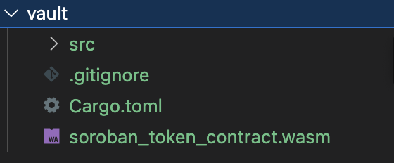

import Tabs from "@theme/Tabs";
import TabItem from "@theme/TabItem";

# Advanced Smart Contracts with Solidity, Rust, and Soroban

In this tutorial, we will cover advanced Solidity and Rust concepts such as inheritance, interfaces, libraries, and modifiers. Additionally, we will learn how to write safe and efficient Rust code for smart contracts, use Rust and Soroban to develop custom smart contract logic, and deploy and test smart contracts in a local development environment.

## Table of Contents

1. [Advanced Solidity Concepts](#advanced-solidity-concepts)
2. [Advanced Rust Concepts](#advanced-rust-concepts)
3. [Writing Safe and Efficient Rust Code for Smart Contracts](#writing-safe-and-efficient-rust-code-for-smart-contracts)
4. [Using Rust and Soroban for Smart Contract Development](#rust-and-soroban)
5. [Deploying and Testing Smart Contracts Locally](#deploying-and-testing)

## Advanced Solidity Concepts

### Inheritance

In Solidity, smart contracts can inherit properties and functions from other contracts. This is achieved using the `is` keyword.

```solidity
contract Parent {
    function messageFromParent() public pure returns (string memory) {
        return "Hello from Parent";
    }
}
contract Child is Parent {
    function messageFromChild(string memory newMessage) public pure returns (string memory) {
        string memory messageFromParent = messageFromParent();
        return string(abi.encodePacked(messageFromParent,', ', newMessage));
    }
}
```

### Interfaces

Interfaces are similar to abstract contracts, but they cannot have any function implementations. They only contain function signatures. Contracts can implement interfaces using the `is` keyword, similar to inheritance.

```solidity
interface SomeInterface {
    function doSomething() external returns (uint256);
}

contract SomeContract is SomeInterface {
    uint256 private counter;

    function doSomething() external override returns (uint256) {
        counter += 1;
        return counter;
    }
}
```

### Libraries

Libraries are similar to contracts, but they cannot have any state variables. They are used to store reusable code that can be used by other contracts. Libraries are deployed once and can be used by multiple contracts. They are defined using the `library` keyword.

```solidity
library SafeMath {
    function add(uint256 a, uint256 b) internal pure returns (uint256) {
        uint256 c = a + b;
        require(c >= a, "Addition overflow");

        return c;
    }
}

contract MyContract {
    using SafeMath for uint256;

    uint256 public value;

    function increment(uint256 amount) public {
        value = value.add(amount);
    }
}
```

### Modifiers

Modifiers are used to change the behavior of functions in a declarative way. They are defined using the `modifier` keyword. Modifiers can be used to perform common checks such as validating inputs, checking permissions, and more.

```solidity
contract Ownable {
    address public owner;

    constructor() {
        owner = msg.sender;
    }

    modifier onlyOwner() {
        require(msg.sender == owner, "Caller is not the owner");
        _;
    }
}

contract MyContract is Ownable {
    function doSomething() public onlyOwner {
        // This function can only be called by the owner of the contract
    }
}
```

## Advanced Rust Concepts

### Inheritance

Rust does not support classical inheritance like Solidity or other object-oriented languages. However, you can achieve similar functionality using `traits` and their implementations.

Here is an example of a `Greeter` trait that defines a `hello` function:

```rust
#![no_std]
use soroban_sdk::{contractimpl, vec, Env, Symbol, Vec};

// Define the Greeter trait
pub trait Greeter {
    fn hello(&self, env: Env, to: Symbol) -> Vec<Symbol>;
}

// Implement the Greeter trait for the HelloContract struct
pub struct HelloContract;

impl Greeter for HelloContract {
    fn hello(&self, env: Env, to: Symbol) -> Vec<Symbol> {
        vec![&env, Symbol::short("Hello"), to]
    }
}

// Add a contract implementation for the HelloContract struct
#[contractimpl]
impl HelloContract {
    // Define a public method that delegates the call to the hello method from the Greeter trait
    pub fn greet(env: Env, to: Symbol, from: Symbol) -> Vec<Symbol> {
        let mut greeting = Self.hello(env.clone(), to);
        greeting.push_back(Symbol::short("From"));
        greeting.push_back(from);
        greeting
    }
}

#[cfg(test)]

mod test;
```

Lets break down the code above:

```rust
#![no_std]
use soroban_sdk::{contractimpl, vec, Env, Symbol, Vec};
```

The `#![no_std]` attribute tells the Rust compiler to not link the standard library. This is required for smart contracts because they are compiled to WebAssembly, which does not have a standard library. The `use` statement then imports several types from the `Soroban SDK`, including the `contractimpl` macro, `vec` module, `Env` struct, `Symbol` struct, and `Vec` type.

```rust
pub trait Greeter {
    fn hello(&self, env: Env, to: Symbol) -> Vec<Symbol>;
}

pub struct HelloContract;

impl Greeter for HelloContract {
    fn hello(&self, env: Env, to: Symbol) -> Vec<Symbol> {
        vec![&env, Symbol::short("Hello"), to]
    }
}
```

The `Greeter` trait defines a single function called `hello`. The `HelloContract` struct implements the `Greeter` trait by defining the `hello` function. The `hello` function returns a `Vec` of `Symbol`s that contains the `Env`, `Hello`, and `to` parameters.

```rust
#[contractimpl]

impl HelloContract {
    pub fn greet(env: Env, to: Symbol, from: Symbol) -> Vec<Symbol> {
        let mut greeting = Self.hello(env.clone(), to);
        greeting.push_back(Symbol::short("From"));
        greeting.push_back(from);
        greeting
    }
}
```

The `#[contractimpl]` attribute tells the `contractimpl` macro to generate a contract implementation for the `HelloContract` struct. The `HelloContract` struct must implement the `Greeter` trait in order for the macro to generate a contract implementation. The `greet` function is a public method that delegates the call to the `hello` method from the `Greeter` trait. It then adds the `from` parameter to the end of the `greeting` vector and returns it.

Example output:

```zsh
["Hello","Alice","From","Bob"]
```

### Interfaces

Interfaces are an essential part of building smart contracts with the `Soroban SDK`.

There are many types of smart contract interfaces, and each has a specific purpose. One example of a smart contract interface built with `Soroban SDK` is the Token Interface. This interface ensures that tokens deployed on Soroban are interoperable with contracts built to support Soroban's built-in tokens. The Token Interface consists of three compatibility requirements:

- function interface
- authorization
- events

For more information on smart contract interfaces built with Soroban SDK, including the Token Interface, visit the [interfaces section](../category/interfaces) of the documentation.

### Libraries

In Rust, libraries are essentially a collection of related functions and types, usually organized in modules. They can be shared across multiple projects by publishing them as crates.

Here is an example of a library that defines a `SafeMath` module with an `add` function:

```rust
#![no_std]

// Imports
use soroban_sdk::{contractimpl, Env};

// safe_math.rs
pub fn add(a: u32, b: u32) -> u32 {
    a.checked_add(b).expect("Addition overflow")
}

// math_contract.rs
pub trait MathContract {
    fn add(&self, env: Env, a: u32, b: u32) -> u32;
}

pub struct Adder;

impl MathContract for Adder {
    fn add(&self, _env: Env, a: u32, b: u32) -> u32 {
        add(a, b)
    }
}

#[contractimpl]
impl Adder {}

// test module
#[cfg(test)]
mod test;
```

Notice that we use the `checked_add` function from the standard library to ensure that the addition does not overflow. This is important because if the addition overflows, it could lead to unexpected behavior in the contract.

Even when Rust code is compiled with the #![no_std] flag, it is still possible to use some of the standard library's features, such as the `checked_add` function. This is because Rust provides the option to selectively import modules and functions from the standard library, allowing developers to use only the specific features they need.

### Modifiers

Rust does not have a built-in modifier system like Solidity. However, you can achieve similar functionality using `traits` and their implementations.

```rust
#![no_std]

// Imports
use soroban_sdk::{contracttype, Address};

// Define the `Ownable` trait
trait Ownable {
    fn is_owner(&self, owner: &Address) -> bool;
}

// Implement the `Ownable` trait for the `OwnableContract` struct
impl Ownable for OwnableContract {
    fn is_owner(&self, owner: &Address) -> bool {
        self.owner == *owner
    }
}

// Define a modifier that requires the caller to be the owner of the contract
fn only_owner(contract: &OwnableContract, owner: &Address) -> bool {
    contract.is_owner(owner)
}

// Implement the contract for the `OwnableContract` struct
#[contracttype]

// Define the `OwnableContract` struct
pub struct OwnableContract {
    owner: Address,
    number: u32,
}

impl OwnableContract {
    // Define a public method that requires the caller to be the owner of the contract
    pub fn change_number(&mut self, new_number: u32) {
        if only_owner(self, &self.owner) {
            self.number = new_number;
        }
    }
}

#[cfg(test)]
mod test;
```

It's worth mentioning that the Soroban SDK comes with several built-in requirements that developers can use, such as the require_auth method provided by the Address struct [more details can be found in the official documentation](https://docs.rs/soroban-sdk/latest/soroban_sdk/struct.Address.html#method.require_auth).

## Writing Safe and Efficient Rust Code for Smart Contracts

When writing Rust code for smart contracts, it's important to focus on safety and efficiency. Some tips include:

- Use the [`Result`](https://doc.rust-lang.org/book/ch09-02-recoverable-errors-with-result.html) type to to handle errors in a safe and predictable way. In smart contracts, it's important to avoid panicking, as this can lead to unpredictable behavior. Instead, Result can be used to handle errors and ensure that the contract behaves as expected.

```rust
pub fn add(a: u32, b: u32) -> Result<u32, &'static str> {
    a.checked_add(b).ok_or("Addition overflow")
}
```

- Use the `checked_` family of functions, such as `checked_add`, `checked_sub`, etc., to perform arithmetic operations in a safe and efficient manner. These functions check for overflows and underflows and return an error if one occurs.

```rust
pub fn add(a: u32, b: u32) -> u32 {
    a.checked_add(b).expect("Addition overflow")
}
```

- Use `cargo` and `clippy` to enforcing code quality, style, and efficiency in Rust. `cargo` is Rust's package manager and provides a number of tools for building and testing Rust code. `clippy` is a linter that can help identify potential issues in the code, such as unused variables or functions that could be optimized.

To use clippy with cargo, you'll first need to install it. You can do this by running the following command in your terminal:

```zsh
cargo install clippy
```

Once clippy is installed, you can run it by running the following command in your terminal:

```zsh
cargo clippy
```

This will run clippy on your entire project, checking for potential issues and providing suggestions for improvement. Clippy will output any issues it finds, along with suggestions for how to fix them.

- Use `cargo` and `rustfmt` to enforce code style. `rustfmt` is a tool that can automatically format Rust code according to the Rust style guide. This can help ensure that the code is consistent and easy to read.

To use rustfmt with cargo, you'll first need to install it. You can do this by running the following command in your terminal:

```zsh
cargo install rustfmt
```

Once rustfmt is installed, you can run it by running the following command in your terminal:

```zsh
cargo fmt
```

Before:

```rust
fn main()
{
let x=5;
if x==5 {
println!("Hello, world!");
}
}
```

After:

```rust
fn main() {
    let x = 5;
    if x == 5 {
        println!("Hello, world!");
    }
}
```

## Rust and Soroban

### Introduction

We've learned that Smart contracts are self-executing contracts that can be programmed to automatically enforce the rules and regulations of a particular agreement. They are a core component of decentralized applications (dApps) and blockchain technology. In this section, we will learn how to use Rust and Soroban to develop and deploy custom smart contract logic.

### Setup

If you haven't already setup up the dev environment for Soroban, you can get started by following the steps on the [Setup Page](http://localhost:3000/docs/getting-started/setup).

This project requires using the `soroban_token_contract.wasm` file which you will need to import manually.

First, you will need to clone the v0.7.0 tag of soroban-examples repository:

```zsh
git clone -b v0.7.0 https://github.com/stellar/soroban-examples
```

then navigate to the `soroban-examples/token` directory and run the following command:

```zsh
cargo build --target wasm32-unknown-unknown --release
```

This will build the `soroban_token_contract.wasm` file which you will need to import into your project. The `soroban_token_contract.wasm` file is located in the `target/wasm32-unknown-unknown/release` directory.

Once we have the Token, lets create a new smart contract that uses it.

### Writing a Smart Contract

Let's start by writing a simple example of a vault contract that allows users to deposit funds and withdraw their funds with generated yield. The vault contract allows users to deposit funds, mint shares in proportion to their deposit, and withdraw their funds along with the generated yield.

How a breakdown of the contract mechanics

- Shares are minted when a user deposits.
- The DeFi protocol uses the users' deposits to generate yield.
- User burns shares to withdraw their tokens + yield.

Lets create a new Rust project by running the following command in your terminal:

```zsh
cargo new vault
```

This will create a new Rust project called `vault`.

Now lets add the `soroban_token_contract.wasm` file to the `vault` project. To do this, we can drag and drop the file into the `vault` project directory.



Next, we'll need to add the Soroban SDK as a dependency. To do this, open the `Cargo.toml` file in your project and ensure that it looks like the following:

```toml
[package]
name = "vault"
version = "0.0.0"
edition = "2021"
publish = false

[lib]
crate-type = ["cdylib"]

[dependencies]
soroban-sdk = { version = "0.7.0", git = "https://github.com/stellar/rs-soroban-sdk", rev = "8abd3353c728f09ee1c8a2544f67a853e915afc2"}
num-integer = { version = "0.1.45", default-features = false, features = ["i128"] }

[dev_dependencies]
soroban-sdk = { version = "0.7.0", git = "https://github.com/stellar/rs-soroban-sdk", rev = "8abd3353c728f09ee1c8a2544f67a853e915afc2", features = ["testutils"] }

[profile.release]
opt-level = "z"
overflow-checks = true
debug = 0
strip = "symbols"
debug-assertions = false
panic = "abort"
codegen-units = 1
lto = true

[profile.release-with-logs]
inherits = "release"
debug-assertions = true
```

In this project we will create 3 files:

- `src/lib.rs` - This is where we will write our vault smart contract logic.
- `src/test.rs` - This is where we will write our tests.
- `src/token.rs` - This is file inherits the token contact that we imported earlier. It's also where we will write our token creation logic.

To interact with the token contract, we'll use a built in interface that you can find in the `token_interface.rs` tab. This interface includes the `initialize` and `mint` functions that we will use to create and mint tokens for us to use in our vault contract. If you want to see the full code of the token contract, you can check it out [here](https://github.com/stellar/soroban-examples/tree/main/token/src).

<Tabs>
<TabItem value="lib.rs" label="src/lib.rs">

```rust
#![no_std]

mod test;
mod token;

use soroban_sdk::{contractimpl, Address, Bytes, BytesN, ConversionError, Env, RawVal, TryFromVal};
use token::create_contract;

#[derive(Clone, Copy)]
#[repr(u32)]
pub enum DataKey {
    Token = 0,
    TokenShare = 1,
    TotalShares = 2,
    Reserve = 3,
}

impl TryFromVal<Env, DataKey> for RawVal {
    type Error = ConversionError;

    fn try_from_val(_env: &Env, v: &DataKey) -> Result<Self, Self::Error> {
        Ok((*v as u32).into())
    }
}

fn get_token(e: &Env) -> BytesN<32> {
    e.storage().get_unchecked(&DataKey::Token).unwrap()
}

fn get_token_share(e: &Env) -> BytesN<32> {
    e.storage().get_unchecked(&DataKey::TokenShare).unwrap()
}

fn get_total_shares(e: &Env) -> i128 {
    e.storage().get_unchecked(&DataKey::TotalShares).unwrap()
}

fn get_reserve(e: &Env) -> i128 {
    e.storage().get_unchecked(&DataKey::Reserve).unwrap()
}

fn get_balance(e: &Env, contract_id: BytesN<32>) -> i128 {
    token::Client::new(e, &contract_id).balance(&e.current_contract_address())
}

fn get_token_balance(e: &Env) -> i128 {
    get_balance(e, get_token(e))
}

fn get_balance_shares(e: &Env) -> i128 {
    get_balance(e, get_token_share(e))
}

fn put_token(e: &Env, contract_id: BytesN<32>) {
    e.storage().set(&DataKey::Token, &contract_id);
}

fn put_token_share(e: &Env, contract_id: BytesN<32>) {
    e.storage().set(&DataKey::TokenShare, &contract_id);
}

fn put_total_shares(e: &Env, amount: i128) {
    e.storage().set(&DataKey::TotalShares, &amount)
}

fn put_reserve(e: &Env, amount: i128) {
    e.storage().set(&DataKey::Reserve, &amount)
}

fn burn_shares(e: &Env, amount: i128) {
    let total = get_total_shares(e);
    let share_contract_id = get_token_share(e);

    token::Client::new(e, &share_contract_id).burn(&e.current_contract_address(), &amount);
    put_total_shares(e, total - amount);
}

fn mint_shares(e: &Env, to: Address, amount: i128) {
    let total = get_total_shares(e);
    let share_contract_id = get_token_share(e);

    token::Client::new(e, &share_contract_id).mint(&e.current_contract_address(), &to, &amount);

    put_total_shares(e, total + amount);
}

fn transfer(e: &Env, contract_id: BytesN<32>, to: Address, amount: i128) {
    token::Client::new(e, &contract_id).xfer(&e.current_contract_address(), &to, &amount);
}

fn transfer_token(e: &Env, to: Address, amount: i128) {
    transfer(e, get_token(e), to, amount);
}

pub trait VaultTrait {
    // Sets the token contract addresses for this vault
    fn initialize(e: Env, token_wasm_hash: BytesN<32>, token: BytesN<32>);

    // Returns the token contract address for the vault share token
    fn share_id(e: Env) -> BytesN<32>;

    // Deposits token. Also mints vault shares for the "to" Identifier. The amount minted
    // is determined based on the difference between the reserves stored by this contract, and
    // the actual balance of token for this contract.
    fn deposit(e: Env, to: Address, amount: i128);

    // xfers share_amount of vault share tokens to this contract, burns all vaults share tokens in this contracts, and sends the
    // corresponding amount of token to "to".
    // Returns amount of token withdrawn
    fn withdraw(e: Env, to: Address, amount: i128) -> i128;

    fn get_rsrvs(e: Env) -> i128;
}

struct Vault;

#[contractimpl]
impl VaultTrait for Vault {
    fn initialize(e: Env, token_wasm_hash: BytesN<32>, token: BytesN<32>) {
        let share_contract_id = create_contract(&e, &token_wasm_hash, &token);
        token::Client::new(&e, &share_contract_id).initialize(
            &e.current_contract_address(),
            &7u32,
            &Bytes::from_slice(&e, b"Vault Share Token"),
            &Bytes::from_slice(&e, b"VLT"),
        );

        put_token(&e, token);
        put_token_share(&e, share_contract_id.try_into().unwrap());
        put_total_shares(&e, 0);
        put_reserve(&e, 0);
    }

    fn share_id(e: Env) -> BytesN<32> {
        get_token_share(&e)
    }

    fn deposit(e: Env, to: Address, amount: i128) {
        // Depositor needs to authorize the deposit
        to.require_auth();

        let token_client = token::Client::new(&e, &get_token(&e));

        token_client.xfer(&to, &e.current_contract_address(), &amount);

        let balance_a = get_token_balance(&e);
        let total_shares = get_total_shares(&e);

        mint_shares(&e, to, amount);
        put_reserve(&e, balance_a);
        put_total_shares(&e, total_shares + amount)
    }

    fn withdraw(e: Env, to: Address, amount: i128) -> i128 {
        to.require_auth();

        // First transfer the vault shares that need to be redeemed
        let share_token_client = token::Client::new(&e, &get_token_share(&e));
        share_token_client.xfer(&to, &e.current_contract_address(), &amount);

        let balance = get_token_balance(&e);
        let balance_shares = get_balance_shares(&e);

        let total_shares = get_total_shares(&e);

        if total_shares < amount {
            panic!("not enought shares to withdraw");
        }

        burn_shares(&e, balance_shares);
        transfer_token(&e, to.clone(), amount);
        put_reserve(&e, balance - amount);

        amount
    }

    fn get_rsrvs(e: Env) -> i128 {
        get_reserve(&e)
    }
}
```

</TabItem>
<TabItem value="test.rs" label="src/test.rs" default>

```rust
#![cfg(test)]

use crate::{token, VaultClient};

use soroban_sdk::{testutils::Address as _, Address, BytesN, Env};

fn create_token_contract(e: &Env, admin: &Address) -> token::Client {
    token::Client::new(&e, &e.register_stellar_asset_contract(admin.clone()))
}

fn create_vault_contract(e: &Env, token_wasm_hash: &BytesN<32>, token: &BytesN<32>) -> VaultClient {
    let vault = VaultClient::new(e, &e.register_contract(None, crate::Vault {}));
    vault.initialize(token_wasm_hash, token);
    vault
}

fn install_token_wasm(e: &Env) -> BytesN<32> {
    soroban_sdk::contractimport!(file = "./soroban_token_contract.wasm");
    e.install_contract_wasm(WASM)
}

#[test]
fn test() {
    let e: Env = Default::default();

    let admin1 = Address::random(&e);

    let token = create_token_contract(&e, &admin1);
    let user = Address::random(&e);
    let vault = create_vault_contract(&e, &install_token_wasm(&e), &token.contract_id);

    let contract_share: [u8; 32] = vault.share_id().into();
    let token_share = token::Client::new(&e, &contract_share);

    token.mint(&admin1, &user, &1000);
    assert_eq!(token.balance(&user), 1000);

    assert_eq!(token_share.balance(&user), 0);
    vault.deposit(&user, &100);
    assert_eq!(token_share.balance(&user), 100);
    assert_eq!(token_share.balance(&vault.address()), 0);
    assert_eq!(token.balance(&user), 900);
    assert_eq!(token.balance(&vault.address()), 100);

    vault.withdraw(&user, &100);
    assert_eq!(token.balance(&user), 1000);
    assert_eq!(token_share.balance(&user), 0);
    assert_eq!(token.balance(&vault.address()), 0);
    assert_eq!(token_share.balance(&vault.address()), 0);
}
```

</TabItem>
<TabItem value="token.rs" label="src/token.rs" default>

```rust
#![allow(unused)]
use soroban_sdk::{Bytes, BytesN, Env};

soroban_sdk::contractimport!(file = "./soroban_token_contract.wasm");

pub fn create_contract(e: &Env, token_wasm_hash: &BytesN<32>, token_a: &BytesN<32>) -> BytesN<32> {
    let mut salt = Bytes::new(e);
    salt.append(&token_a.clone().into());

    let salt = e.crypto().sha256(&salt);
    e.deployer()
        .with_current_contract(&salt)
        .deploy(token_wasm_hash)
}
```

</TabItem>

<TabItem value="token_interface.rs" label="src/token_interface.rs">

```rust
//! This contract demonstrates a sample implementation of the Soroban token
//! interface.
use crate::admin::{check_admin, has_administrator, write_administrator};
use crate::allowance::{read_allowance, spend_allowance, write_allowance};
use crate::balance::{is_authorized, write_authorization};
use crate::balance::{read_balance, receive_balance, spend_balance};
use crate::event;
use crate::metadata::{
    read_decimal, read_name, read_symbol, write_decimal, write_name, write_symbol,
};
use soroban_sdk::{contractimpl, Address, Bytes, Env};

pub trait TokenTrait {
    fn initialize(e: Env, admin: Address, decimal: u32, name: Bytes, symbol: Bytes);

    fn allowance(e: Env, from: Address, spender: Address) -> i128;

    fn incr_allow(e: Env, from: Address, spender: Address, amount: i128);

    fn decr_allow(e: Env, from: Address, spender: Address, amount: i128);

    fn balance(e: Env, id: Address) -> i128;

    fn spendable(e: Env, id: Address) -> i128;

    fn authorized(e: Env, id: Address) -> bool;

    fn xfer(e: Env, from: Address, to: Address, amount: i128);

    fn xfer_from(e: Env, spender: Address, from: Address, to: Address, amount: i128);

    fn burn(e: Env, from: Address, amount: i128);

    fn burn_from(e: Env, spender: Address, from: Address, amount: i128);

    fn clawback(e: Env, admin: Address, from: Address, amount: i128);

    fn set_auth(e: Env, admin: Address, id: Address, authorize: bool);

    fn mint(e: Env, admin: Address, to: Address, amount: i128);

    fn set_admin(e: Env, admin: Address, new_admin: Address);

    fn decimals(e: Env) -> u32;

    fn name(e: Env) -> Bytes;

    fn symbol(e: Env) -> Bytes;
}

fn check_nonnegative_amount(amount: i128) {
    if amount < 0 {
        panic!("negative amount is not allowed: {}", amount)
    }
}

pub struct Token;

#[contractimpl]
impl TokenTrait for Token {
    fn initialize(e: Env, admin: Address, decimal: u32, name: Bytes, symbol: Bytes) {
        if has_administrator(&e) {
            panic!("already initialized")
        }
        write_administrator(&e, &admin);

        write_decimal(&e, u8::try_from(decimal).expect("Decimal must fit in a u8"));
        write_name(&e, name);
        write_symbol(&e, symbol);
    }

    fn allowance(e: Env, from: Address, spender: Address) -> i128 {
        read_allowance(&e, from, spender)
    }

    fn incr_allow(e: Env, from: Address, spender: Address, amount: i128) {
        from.require_auth();

        check_nonnegative_amount(amount);

        let allowance = read_allowance(&e, from.clone(), spender.clone());
        let new_allowance = allowance
            .checked_add(amount)
            .expect("Updated allowance doesn't fit in an i128");

        write_allowance(&e, from.clone(), spender.clone(), new_allowance);
        event::incr_allow(&e, from, spender, amount);
    }

    fn decr_allow(e: Env, from: Address, spender: Address, amount: i128) {
        from.require_auth();

        check_nonnegative_amount(amount);

        let allowance = read_allowance(&e, from.clone(), spender.clone());
        if amount >= allowance {
            write_allowance(&e, from.clone(), spender.clone(), 0);
        } else {
            write_allowance(&e, from.clone(), spender.clone(), allowance - amount);
        }
        event::decr_allow(&e, from, spender, amount);
    }

    fn balance(e: Env, id: Address) -> i128 {
        read_balance(&e, id)
    }

    fn spendable(e: Env, id: Address) -> i128 {
        read_balance(&e, id)
    }

    fn authorized(e: Env, id: Address) -> bool {
        is_authorized(&e, id)
    }

    fn xfer(e: Env, from: Address, to: Address, amount: i128) {
        from.require_auth();

        check_nonnegative_amount(amount);
        spend_balance(&e, from.clone(), amount);
        receive_balance(&e, to.clone(), amount);
        event::transfer(&e, from, to, amount);
    }

    fn xfer_from(e: Env, spender: Address, from: Address, to: Address, amount: i128) {
        spender.require_auth();

        check_nonnegative_amount(amount);
        spend_allowance(&e, from.clone(), spender, amount);
        spend_balance(&e, from.clone(), amount);
        receive_balance(&e, to.clone(), amount);
        event::transfer(&e, from, to, amount)
    }

    fn burn(e: Env, from: Address, amount: i128) {
        from.require_auth();

        check_nonnegative_amount(amount);
        spend_balance(&e, from.clone(), amount);
        event::burn(&e, from, amount);
    }

    fn burn_from(e: Env, spender: Address, from: Address, amount: i128) {
        spender.require_auth();

        check_nonnegative_amount(amount);
        spend_allowance(&e, from.clone(), spender, amount);
        spend_balance(&e, from.clone(), amount);
        event::burn(&e, from, amount)
    }

    fn clawback(e: Env, admin: Address, from: Address, amount: i128) {
        check_nonnegative_amount(amount);
        check_admin(&e, &admin);
        admin.require_auth();
        spend_balance(&e, from.clone(), amount);
        event::clawback(&e, admin, from, amount);
    }

    fn set_auth(e: Env, admin: Address, id: Address, authorize: bool) {
        check_admin(&e, &admin);
        admin.require_auth();
        write_authorization(&e, id.clone(), authorize);
        event::set_auth(&e, admin, id, authorize);
    }

    fn mint(e: Env, admin: Address, to: Address, amount: i128) {
        check_nonnegative_amount(amount);
        check_admin(&e, &admin);
        admin.require_auth();
        receive_balance(&e, to.clone(), amount);
        event::mint(&e, admin, to, amount);
    }

    fn set_admin(e: Env, admin: Address, new_admin: Address) {
        check_admin(&e, &admin);
        admin.require_auth();
        write_administrator(&e, &new_admin);
        event::set_admin(&e, admin, new_admin);
    }

    fn decimals(e: Env) -> u32 {
        read_decimal(&e)
    }

    fn name(e: Env) -> Bytes {
        read_name(&e)
    }

    fn symbol(e: Env) -> Bytes {
        read_symbol(&e)
    }
}
```

</TabItem>
</Tabs>

<Tabs>
<TabItem value="build" label="build.sh">

```bash
cargo build --target wasm32-unknown-unknown --release
```

</TabItem>

<TabItem value="deploy token" label="deploy_token.sh">

```bash
soroban contract deploy \
    --wasm soroban_token_contract.wasm \
    --source S... \
    --rpc-url https://rpc-futurenet.stellar.org:443 \
    --network-passphrase 'Test SDF Future Network ; October 2022'
```

</TabItem>

<TabItem value="initialize token" label="initialize_token.sh">

```bash
soroban contract invoke \
    --wasm soroban_token_contract.wasm \
    --id <TOKEN_CONTRACT_ID> \
    --source S... \
    --rpc-url https://rpc-futurenet.stellar.org:443 \
    --network-passphrase 'Test SDF Future Network ; October 2022' \
    -- \
    initialize \
    --admin G... \
    --decimal 18 \
    --name <TOKEN_NAME> \
    --symbol <TOKEN_SYMBOL>
```

</TabItem>

<TabItem value="mint" label="mint.sh">

```bash
soroban contract invoke \
    --wasm soroban_token_contract.wasm \
    --id <TOKEN_CONTRACT_ID> \
    --source S... \
    --rpc-url https://rpc-futurenet.stellar.org:443 \
    --network-passphrase 'Test SDF Future Network ; October 2022' \
    -- \
    mint \
    --admin G... \
    --to G... \
    --amount 1000000000000000000000000000
```

</TabItem>

<TabItem value="balance" label="balance.sh">

```bash
soroban contract invoke \
    --wasm soroban_token_contract.wasm \
    --id <TOKEN_CONTRACT_ID> \
    --source S... \
    --rpc-url https://rpc-futurenet.stellar.org:443 \
    --network-passphrase 'Test SDF Future Network ; October 2022' \
    -- \
        balance \
    --id G...
```

</TabItem>

<TabItem value="insatll wasm" label="install.sh">

```bash
soroban contract install --wasm soroban_token_contract.wasm
```

</TabItem>

<TabItem value="deploy vault" label="deploy_vault.sh">

```bash
soroban contract deploy \
    --wasm target/wasm32-unknown-unknown/release/vault.wasm \
    --source S... \
    --rpc-url https://rpc-futurenet.stellar.org:443 \
    --network-passphrase 'Test SDF Future Network ; October 2022'
```

</TabItem>

<TabItem value="initialize vault" label="initialize_vault.sh">

```bash
soroban contract invoke \
    --wasm target/wasm32-unknown-unknown/release/vault.wasm \
    --id <VAULT_CONTRACT_ID> \
    --source S... \
    --rpc-url https://rpc-futurenet.stellar.org:443 \
    --network-passphrase 'Test SDF Future Network ; October 2022' \
    -- \
    initialize \
    --token_wasm_hash 73593275ee3bcacc2aef8d641a1d5108618064bdfff84a826576b8caff395add \
    --token <TOKEN_CONTRACT_ID>
```

</TabItem>

<TabItem value="get share" label="share_id.sh">

```bash
soroban contract invoke \
    --wasm target/wasm32-unknown-unknown/release/vault.wasm \
    --id <VAULT_CONTRACT_ID> \
    --source S... \
    --rpc-url https://rpc-futurenet.stellar.org:443 \
    --network-passphrase 'Test SDF Future Network ; October 2022' \
    -- \
    share_id
```

</TabItem>

<TabItem value="deposit" label="deposit.sh">

```bash
soroban contract invoke \
    --wasm target/wasm32-unknown-unknown/release/vault.wasm \
    --id <VAULT_CONTRACT_ID> \
    --source S... \
    --rpc-url https://rpc-futurenet.stellar.org:443 \
    --network-passphrase 'Test SDF Future Network ; October 2022' \
    -- \
    deposit \
    --to G... \
    --amount 100
```

</TabItem>

<TabItem value="reserve" label="get_rsrv.sh">

```bash
soroban contract invoke \
    --wasm target/wasm32-unknown-unknown/release/vault.wasm \
    --id <VAULT_CONTRACT_ID> \
    --source S... \
    --rpc-url https://rpc-futurenet.stellar.org:443 \
    --network-passphrase 'Test SDF Future Network ; October 2022' \
    -- \
    get_rsrvs \
```

</TabItem>

<TabItem value="withdraw" label="withdraw">

```bash
soroban contract invoke \
    --wasm target/wasm32-unknown-unknown/release/vault.wasm \
    --id <VAULT_CONTRACT_ID> \
    --source S... \
    --rpc-url https://rpc-futurenet.stellar.org:443 \
    --network-passphrase 'Test SDF Future Network ; October 2022' \
    -- \
    withdraw \
    --to G... \
    --amount 100
```

</TabItem>

</Tabs>
